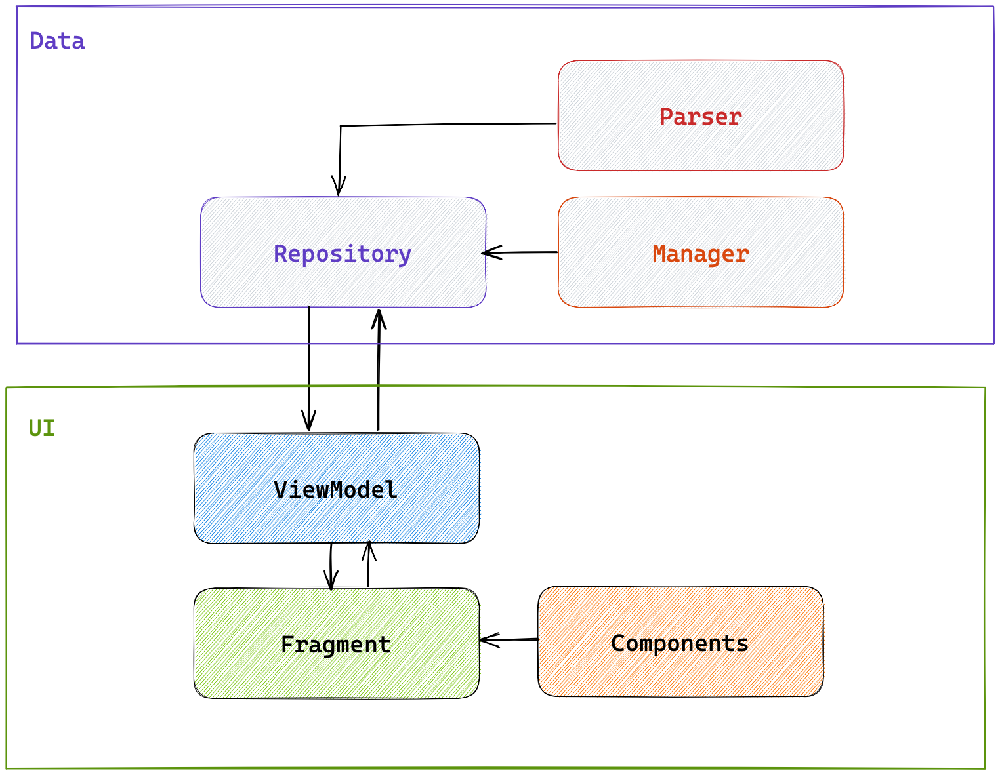

# MusicBrainz Sample app

This a sample app connected to MusicBrainz's `API`. 

## Architecture

The app is using two layers: `data` and `UI`. The goal was to follow `KISS` principles and have a very simple app architecture which can grow over time.

Dependency injection is done using the `Koin` library which is very appropriate and easy to use in this project's context.

### `data` layer

- `Repository` : Entry point of the layer, does business logic and clean the data exposed.
- `Manager` : Single responsibility utility interface, will do the grunt work with no special business logic.

### `UI` layer

- `Fragment` : All ui logic persist in the fragment, composition classes can be injected for shared functionalities.
- `ViewModel` : The glue with the `data` layer. Presents retrieved data to the pure user interface classes.

## Patterns

- Composition over inheritance.
- Use of `interface` for abstraction : Composition classes and `Manager` classes use interface abstraction in order to hide implementation and be flexible in case of a new implementation (or if we want to create fake classes with fake data on runtime).
- MVVM on `UI` layer : The `ViewModel` has no reference to the view and exposes data as streams.
- `StateFlow` & `Flow` in the `ViewModel` : The goal is to provide reactive data which are embedded in a `sealed class`.
- Use of kotlin extension functions : When it's appropriate, we try to use extension functions as much as possible.
- Single responsibility : Every class must have it's own responsibility in order to be testable.

## Tests

There are 3 kind of tests in the app :
- Unit Tests : These tests are run with `JUnit`. Their purpose is to test the single reponsibility of each class tested. We intend to have the maximum of appropriate code coverage. Because this is a unit test, it means that all dependencies are mocked.
- Integration Tests : Tests to validate that there is no regression on a chain of calls. In this case it means that we mock as few classes as possible. If possible we run these tests on `JUnit` but if we don't have any choice, it can be `Instrumentation Tests`.
- End to End Tests : Tests on device to validate critical user journey scenarios of the app. Nothing is supposed to be mocked. It is run as `Instrumentation Tests`

## Continuous integration

As the repository is hosted on `GitHub` then `GitHub Actions` are used to validate the code and ship binaries.

Two workflows exist :
- Pull Request Workflow : The objective is to validate code before merging it to `main` branch. The workflow is triggered when a `Pull Request` is opened and will run the linter, the units tests and build the project.
- Release Workflow : When code has been merged to `main` branch, a workflow is triggered to build a release version of the app with `Proguard` activated. The APK is available as an artefact.

## Todo list

- 😷 Modern & better handling of the `Toolbar` (it's quite hacky at the moment)
- 😴 Handle night/dark mode
- 🐛 Add unit tests for the `Adapter`
- 🤓 Make the view state a generic Resource `class`
- 📈 Improve code coverage and consult it with `Jacoco` reports
- 😻 Bring more joy with a customized app icon & splashscreen